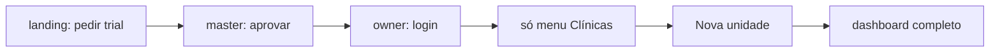

# App Flow — NexoSaúde

Mapa de navegação e fluxos do sistema interno (`/sistema-interno/`) e do portal do paciente (`portal.html?t=TOKEN`). Cada fluxo cita telas reais (`screens/`), regras (`modules/`) e tarefas Operon quando houver.

Ver também: [[PRD]], [[CASOS_DE_USO]], [[DIAGRAMAS_DE_SEQUENCIA]], [[00-index]].

## Rotas e portas de entrada

| Entrada | O quê | Público |
|---|---|---|
| `landing.html` (raiz `/`) | Site + pedido de trial | Sim |
| `/sistema-interno/` | App (login → dashboard) | Login |
| `portal.html?t=TOKEN` | Portal do paciente | Token |
| `anamnese.html` | Anamnese online (prefill + envio) | Link |
| `confirmar.html` | Confirmação de presença | Token |
| `assinatura.html` | Assinatura do plano (owner) | Owner |
| `master.html` | Dono da plataforma (trials, owners, débitos) | Superadmin |

Papéis: `superadmin` (plataforma) · `owner` (clínica) · `dentista`/`psicologo` · `recepcionista`. Menu e abas filtrados por `MenuAccess` + tipo da clínica (`dental` | `psychology`). Sem clínica vinculada (e não superadmin): só o menu **Clínicas** (nx-161).

## F1 — Trial até a primeira clínica

Owner aprovado entra e vê só Clínicas; ao criar a primeira unidade, volta ao dashboard com o menu cheio. Staff (`pending_approval`) espera o owner liberar (`allowedClinics`).

## F2 — Dia a dia: Agenda

`AgendaManagerScreen` (semana por profissional) → toque no evento abre a sheet:

- Abrir Paciente (deep-link sem menu) · Confirmar Presença · WhatsApp · Finalizar → evolução · Editar (data/hora respeitando livres) · Encaixe · Cancelar (motivo + registro)
- Bloco de risco no-show (shimmer → conteúdo); remarcação do portal decide aqui
- Novo agendamento: busca paciente / cadastro rápido (com aceite LGPD) → grade de horários livres → salvar espelha portal (`sessions` + `slots`)
- Gestão da agenda: bloquear Manhã/Tarde/Dia/intervalo (funde adjacentes), Liberar Dia (usa a **semana visível** como data padrão — nx-162)

## F3 — Atendimento (Meu dia)

`CareDayScreen` → presença em massa (checkbox + barra Confirmar) → ficha em 3 blocos:

1. Evolução clínica (vai ao prontuário)
2. Cobrança **somente** de lançamento existente (nunca cria novo)
3. Próxima sessão: repetir +7d · sugestão validada contra a grade · agendar com profissional/horários livres

Finalizar gera `attendanceStatus` (alimenta assiduidade e o bloco de risco).

## F4 — Cobrança e Pagamentos

- `CollectionsScreen` → Receber: à vista · **parcial** (gera filha quitada + pendente fica com o resto, faixa "Parcial: X pagos de Y") · parcelado no cartão (pai vira terminal, filhas são a dívida)
- Estorno: pago volta a pendente; **parcial estornada restaura o cheio e apaga a filha** (parcelamento preserva as parcelas); erro sempre visível em toast
- Cancelar: soft-delete (`cancelado`, família toda se parcelado); Corrigir e relançar; Editar valor/vencimento de pendente
- Aba Pagamentos do paciente: resumo (A Receber com próximo vencimento, Recebido, Custo, Assiduidade) + contexto + timeline por estado (PAGO/A VENCER/VENCIDO há N dias) + WhatsApp "Cobrar" com confirmação registrada no prontuário
- Tudo pago/parcelado reflete no portal na hora (delta com fallback p/ rebuild — nx-159)

## F5 — Paciente (ficha)

Lista (busca + filtro "Sem aceite LGPD") → ficha em abas: Cadastro · Anamnese (+ strip de alertas) · Tratamentos · Prontuário (evoluções, selos Cobrança/Atendimento) · Documentação · **Pagamentos** · Orçamentos. Cartão de contexto (último atendimento + vencidas) monta em paralelo e uma vez por sessão.

## F6 — Orçamento até o tratamento

Novo orçamento (itens do catálogo) → **Aprovar** (wizard: mensalidades de ortodontia, custo automático) → cria plano (`treatment_plans.budgetId`), financeiros (`planId`) e custos (`relatedPlanId`) → Excluir: pendente apaga só o doc; **aprovado apaga em cadeia** (plano, pagamentos, custos, filhas) com contagem e progresso (nx-168).

## F7 — Portal do paciente

Link com token (só nasce com aceite LGPD) → sessões, dívidas com Pix, confirmar presença, **pedir remarcação** (vira pendência laranja na agenda), **avisar pagamento** (selo p/ tesouraria). Espelhos `portal/{token}` (delta por escrita) + `portal_slots/{clinicId}` (grade livre). Sem aceite = sem link; revogar limpa o token.

## F8 — Gestão operacional

Procedimentos · Estoque · Fornecedores · Cartões (perfis de taxa da maquininha) · Configurações (Pix, grade, acessos por flag). Catálogo global + escopo por clínica conforme a coleção.

## F9 — Clínicas e equipe

- Clínicas: criar · Gerenciar (troca a sessão) · **Excluir em cascata** (contagem + digitar o nome; apaga tudo com o `clinicId`, staff só desvincilha, sem reversão — nx-160). Regras exigem owner.
- Funcionários: criar, papéis, `menuAccess` por chave; pendentes aguardam liberação.

## F10 — Relatórios e backup

- Fluxo de Caixa Real (via **Livro Caixa** em Relatórios; fora do menu — nx-169): seletor de mês, filtros Todos/Recebido/A Receber/**Inadimplente** (tag vermelha), imprimir, estorno por long-press.
- Exportar (owner): backup JSON/CSV das coleções.

## Convenções que atravessam os fluxos

- Plano Spark: sem Functions — tudo é clique no app ou script `migrate/` com Admin SDK.
- Multi-tenant por `clinicId` via `SessionManager().applyFilter()`; nunca confiar no formato do banco (`fromMap` defensivo).
- Toda escrita relevante atualiza o espelho do portal (sessões, dívidas, slots).
- PWA versionado (`version.json` + checagem a cada troca de menu, 1x por sessão); deploy só via `deploy.bat` da branch `producao`.
