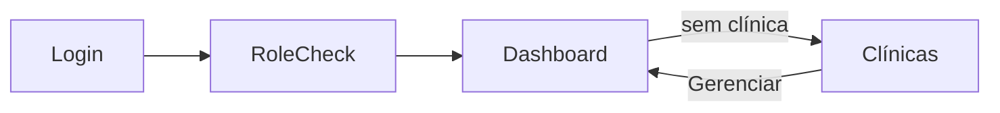

# App Flow — NexoSaúde (tela a tela)

Transições reais verificadas no código (`Navigator` + menu `_screens`).
Seta `A → B (ação)` = na tela A, a ação abre a tela B. `□` = diálogo/sheet
(volta para a origem). Ver também: [[PRD]], [[CASOS_DE_USO]].

## Entrada

- `Login → RoleCheck → MainWebDashboard` (pushReplacement; sem clínica e não superadmin, o menu mostra **só Clínicas** — nx-161).
- `Clínicas → Dashboard` ("Gerenciar": `setClinic` + rebuild zerando a pilha).
- Primeira unidade criada → volta sozinha ao Dashboard.

## Menu (índices fixos do `_screens`)

| # | Tela | Chave | Como chega além do menu |
|---|---|---|---|
| 0 | Dashboard (KPI) | `dashboard` | fallback de índice escondido |
| 1 | Agenda | `agenda` | — |
| 2 | Pacientes (lista) | `pacientes` | — |
| 3 | Laboratório | `laboratorio` | — |
| 4 | Financeiro (Fluxo de Caixa) | `financeiro` | **só** pelo Livro Caixa (fora do menu — nx-169) |
| 5 | Relatórios | `relatorios` | — |
| 6 | Notícias | `noticias` | — |
| 7 | Cobranças | `cobrancas` | KPI (atalhos inadimplência/agenda) |
| 8 | Clínicas | `clinicas` | modo setup trava aqui |
| 9 | Funcionários | `funcionarios` | — |
| 10 | Gestão | `gestao` | — |
| 11 | Fluxo Terapêutico | `fluxo` | — |
| 12 | Atendimento (Meu dia) | `atendimento` | — |
| 13 | Master | `master` | só superadmin |
| 14 | Exportar | `exportar` | só owner |

KPI usa `onNavigate`: avisos → 7 (Cobranças), agenda → 1. Setup (`_onMenuSelect`) bloqueia tudo exceto 8.

## Saídas por tela

**Dashboard (0):** → 7, → 1 (atalhos do KPI).

**Agenda (1):**
- → Ficha do Paciente (toque → sheet → "Abrir Paciente"; deep-link `openPatient`)
- → Novo Agendamento / Alterar / Encaixe (`AgendaFormScreen`)
- □ sheet do evento: Confirmar, WhatsApp, Finalizar→evolução, Editar, Cancelar (motivo), Desbloquear, Decidir remarcação
- □ Gestão da agenda: bloquear intervalos, Liberar Dia

**Pacientes (2):** → Ficha (`PatientDetailsScreen`) · → Novo Paciente (`CreatePatientScreen`) · long-press exclui (cascata do paciente).

**Ficha do Paciente (detalhe, sem rota própria — via push/deep-link):**
- Abas internas (sem navegação): Cadastro · Anamnese · Tratamentos · Prontuário · Documentação · Pagamentos · Orçamentos
- Saídas: □ wizard de recebimento · □ dialogs (estorno/cancelar/editar/recriar) · □ modal da família · □ wizard de aprovação de orçamento · ← Voltar (pilha)

**Laboratório (3):** interno (pedidos, interações). **Notícias (6):** leitura.

**Relatórios (5):** → Financeiro/Livro Caixa (push direto) · → Despesas (`ExpensesScreen`).

**Financeiro (4):** □ imprimir · long-press estorna (com confirmação).

**Cobranças (7):** → Ficha do paciente (ícone pessoa, deep-link) · □ receber/confirmar.

**Atendimento/Meu dia (12):** □ ficha de atendimento (`CareVisitPanel` em sheet 92%: evolução + cobrança existente + próxima sessão) · → Ficha do paciente (deep-link).

**Clínicas (8):** → Dashboard ("Gerenciar") · □ nova unidade · □ excluir em cascata (contagem + digitar nome + progresso).

**Funcionários (9):** interno (criar, papéis, `menuAccess`). **Gestão (10):** 5 abas internas (Procedimentos, Estoque, Fornecedores, Cartões, Config) — sem saída. **Fluxo (11):** kanban interno. **Master (13):** trials, owners, débitos. **Exportar (14):** download.

## Camada deep-link (sem menu)

`openPatient(patientId, name)` → Ficha, usado por: sheet da Agenda, Cobranças (ícone), Meu dia. A Ficha nunca está no menu — sempre por push.

## Páginas web externas (fora do app)

`portal.html?t=TOKEN` (sessões, dívidas/Pix, confirmar, pedir remarcação, avisar pagamento) · `anamnese.html` · `confirmar.html` · `assinatura.html` · `landing.html` · `master.html`. Sem navegação de volta ao app (contextos separados).

## Convenções

- Voltar (`pop`) retorna à origem; "Gerenciar" e login zeram a pilha.
- Diálogos de confirmação antes de: excluir (clínica/orçamento/paciente), estornar, cancelar família, confirmar presença em massa.
- Plano Spark: sem Functions — tudo é clique no app ou script `migrate/` com Admin SDK.
- Deploy só via `deploy.bat` da branch `producao`.
