# OdontoControle - Diagramas de Sequência

Diagramas das principais funcionalidades do sistema. Renderizados em Mermaid (GitHub / VS Code com extensão Mermaid).

---

## 1. Autenticação e Inicialização da Sessão

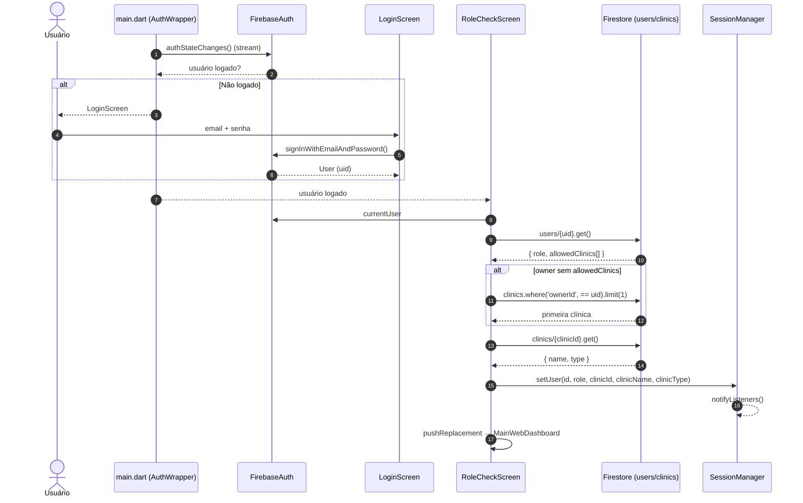

---

## 2. Troca de Clínica (Multi-tenant / Owner)

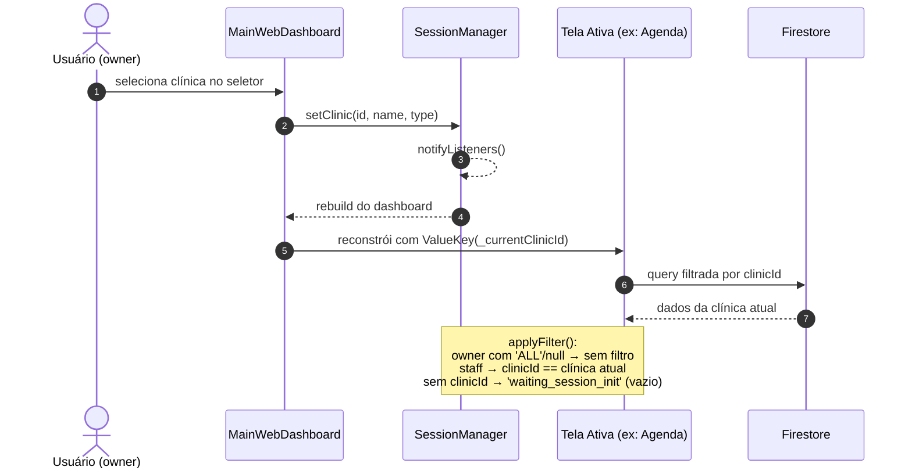

---

## 3. Agenda - Criar Consulta

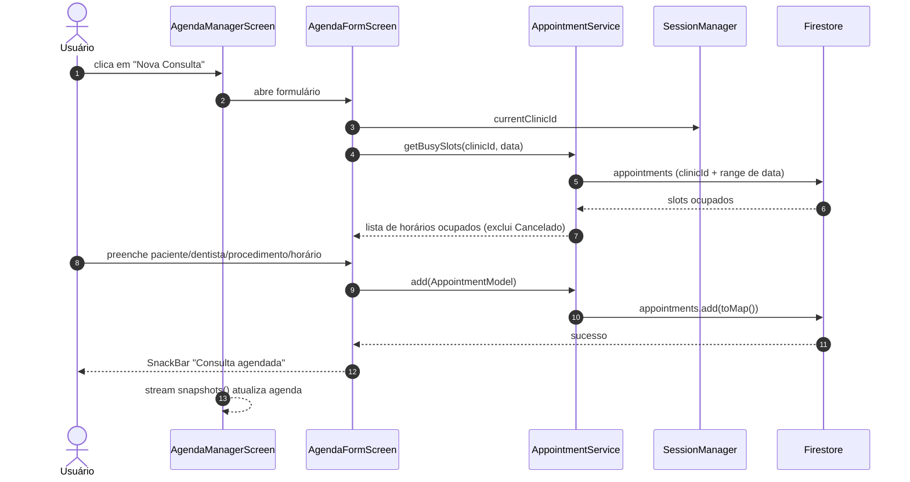

---

## 4. Agenda - Confirmação via WhatsApp

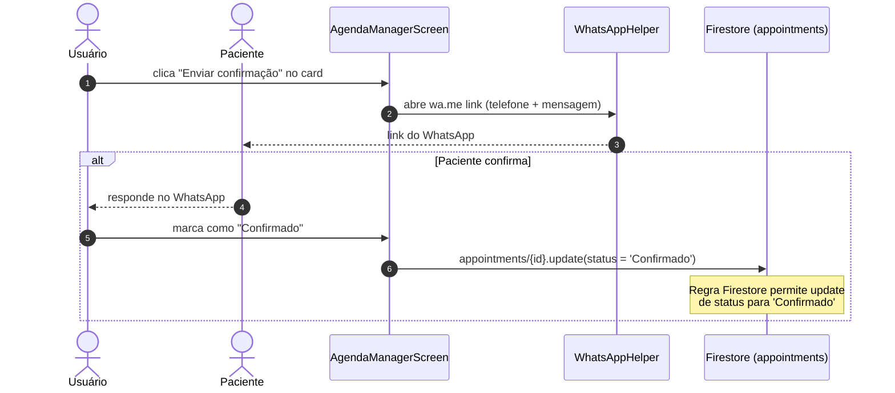

---

## 5. Cadastro de Paciente + Perfil de Risco

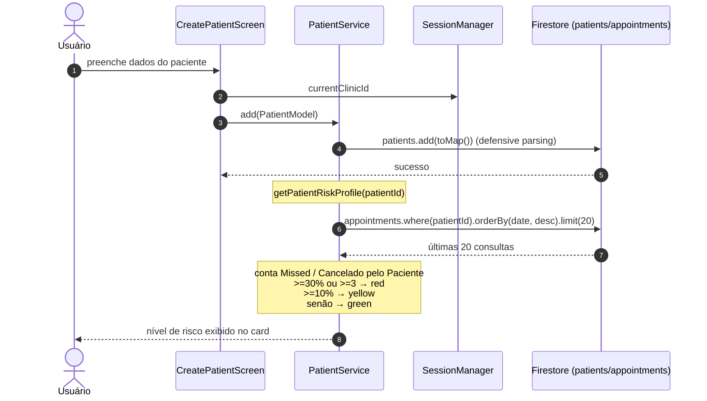

---

## 6. Exclusão em Cascata do Paciente

```mermaid
sequenceDiagram
    autonumber
    actor U as Usuário
    participant PL as PatientListScreen
    participant PS as PatientService
    participant F as Firestore
    participant B as Batch

    U->>PL: confirma exclusão do paciente
    PL->>PS: deletePatientCascade(patientId, clinicId)
    PS->>PS: purgePatientFiles (destroy no Cloudinary via publicId;<br/>sem credenciais em settings/integrations, só Firestore)
    PS->>F: query por coleção (clinicId + patientId)
    F-->>PS: docs encontrados

    loop Para cada coleção
        Note over PS,F: appointments, budgets, treatments,<br/>treatment_plans, financial,<br/>clinical_records, lab_orders,<br/>psychology_schedules, subcoleções
        PS->>B: batch.delete(reference)
    end

    PS->>B: batch.delete(patientRef)
    PS->>F: batch.commit()
    F-->>PS: sucesso
    PS-->>U: "Paciente excluído em cascata (N docs)"
```

---

## 7. Financeiro - Processar Pagamento

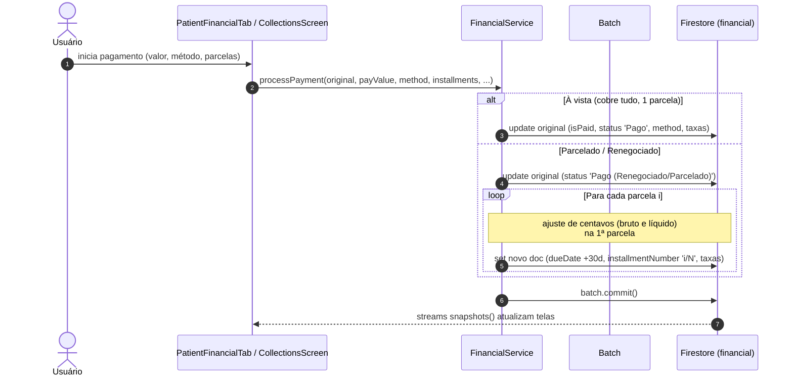

---

## 8. Financeiro - Estorno de Pagamento

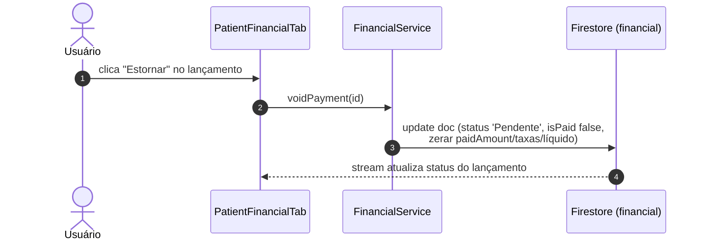

---

## 9. Agenda Psicologia - Gerar Sessões (Pacote / Avulso)

```mermaid
sequenceDiagram
    autonumber
    actor U as Usuário
    participant P as PsychologyScheduleFormScreen
    participant S as SessionManager
    participant F as Firestore
    participant B as Batch

    U->>P: preenche paciente, tipo (pacote/avulsa), dia/hora, valores
    P->>S: currentClinicId
    P->>F: psychology_schedules.add(schedule)
    F-->>P: scheduleId

    P->>P: pacote = generateSessionDates(até 31/12 do ano);<br/>avulsa = 1 sessão na data selecionada
    P->>F: cria treatment_plans (items = sessões, planId)

    alt Pacote
        Note over P,F: 1 doc financeiro por mês<br/>(monthlyPeriod, billingKind, vence dia 10 seguinte)
        P->>B: financial.set(1 doc/mês, installmentNumber 'Jan/2025 1/5', planId)
    else Sessão Avulsa
        P->>B: financial.set(1 doc, dueDate = sessão + 7 dias,<br/>installmentNumber '1/1', billingKind 'session')
    end

    loop Para cada sessão
        P->>B: appointments.set(AppointmentModel,<br/>status 'Aguardando Confirmação', 60min,<br/>scheduleId/planId/monthlyPeriod)
    end

    P->>F: batch.commit()
    P-->>U: "Agendamento salvo e sessões geradas!"
```

---

## 10. Orçamento / Fluxo de Aprovação (gera financeiro direto)

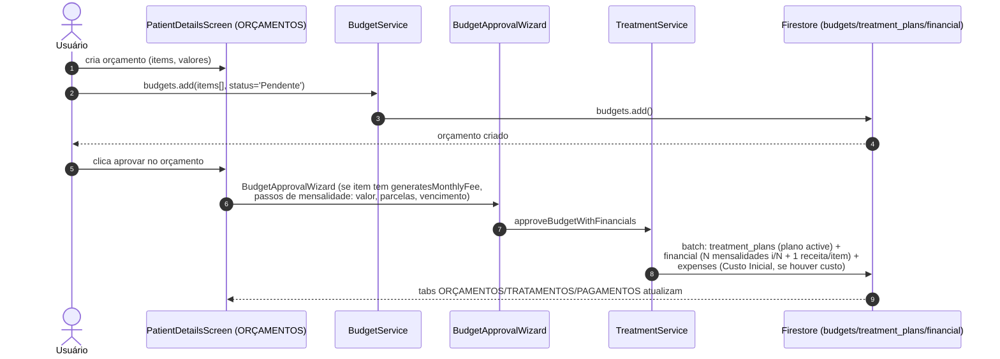

---

## 11. Laboratório - Kanban de Ordens

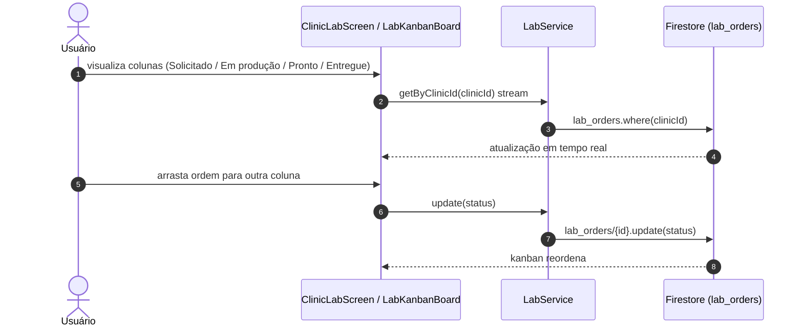

---

## 12. Anamnese Pública (WhatsApp Link)

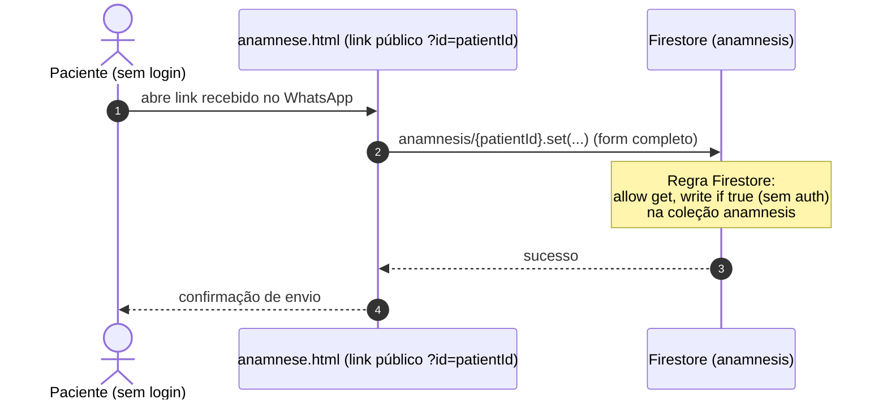

---

## 13. Documentação do Paciente (Upload Cloudinary)

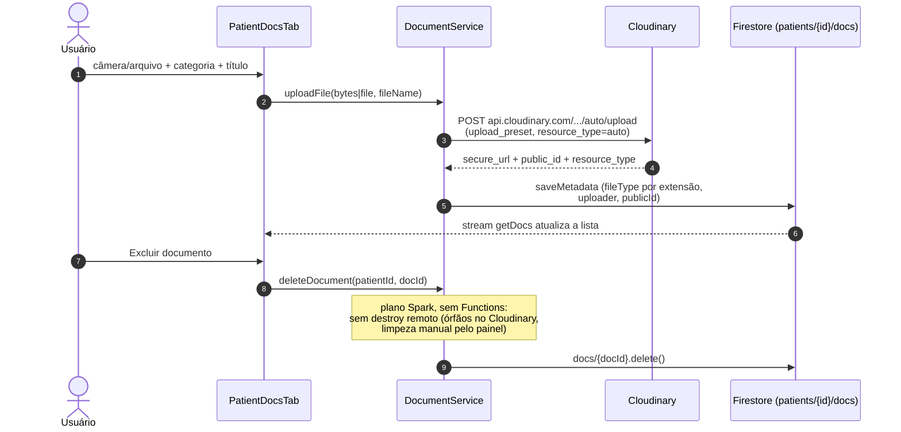

## Ver tamb�m

- [[foundation/01-prd|PRD]] � produto e riscos
- [[foundation/04-requisitos|Requisitos]] � regras por tr�s dos fluxos
- [[foundation/02-use-cases|CASOS_DE_USO]] � atores de cada fluxo
